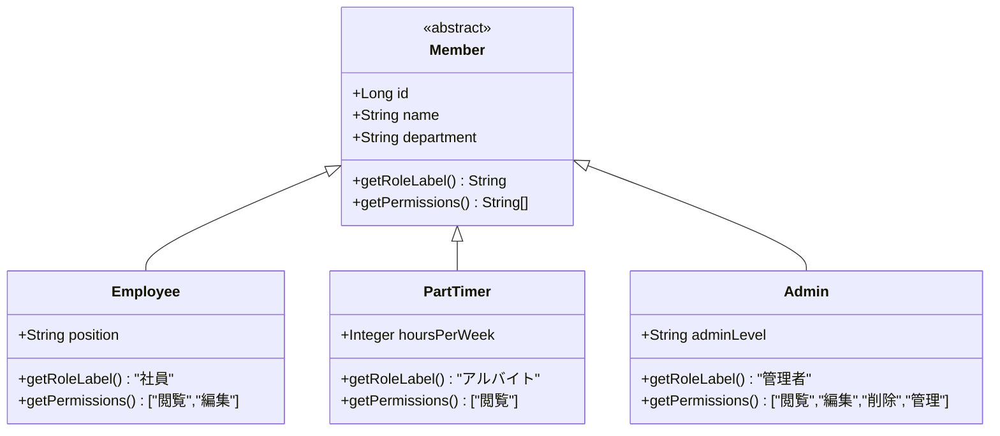
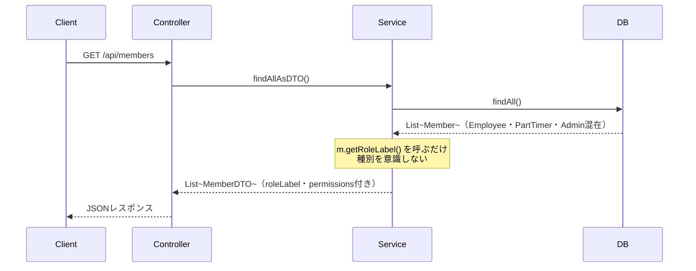
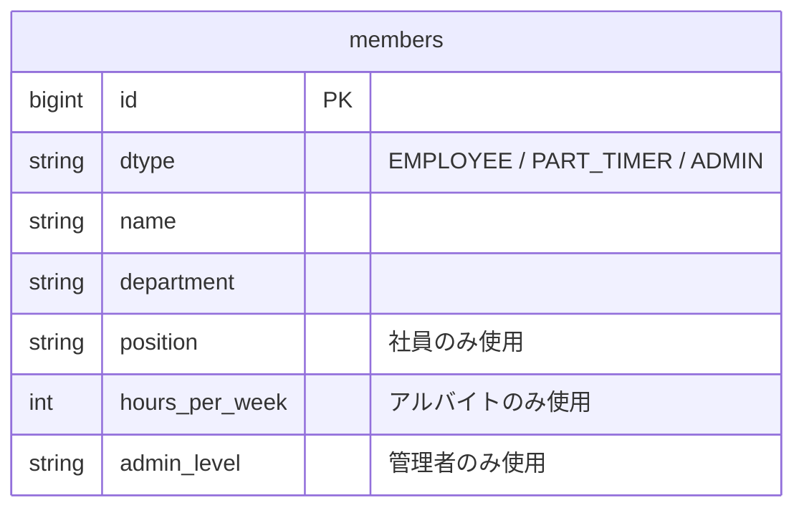

# ポリモーフィズム設計ドキュメント

## 概要

このプロジェクトでは、会員管理システムにJavaのポリモーフィズムを活用しています。
`Employee`（社員）・`PartTimer`（アルバイト）・`Admin`（管理者）という異なる種別の会員を、
`Member`という共通の親クラスで統一的に扱います。

---

## クラス構造



---

## 各クラスの役割

### Member（親クラス）
**ファイル:** `Member.java`

すべての会員に共通するフィールドとメソッドを定義します。
`getRoleLabel()`と`getPermissions()`は**抽象メソッド**として宣言されており、
サブクラスで必ず実装しなければなりません。

```java
public abstract class Member {
    private Long id;
    private String name;
    private String department;

    // サブクラスで実装する抽象メソッド
    public abstract String getRoleLabel();
    public abstract String[] getPermissions();
}
```

---

### サブクラスの比較

| クラス | dtype値 | getRoleLabel() | getPermissions() | 固有フィールド |
|---|---|---|---|---|
| `Employee` | `EMPLOYEE` | `"社員"` | `["閲覧", "編集"]` | `position`（役職）|
| `PartTimer` | `PART_TIMER` | `"アルバイト"` | `["閲覧"]` | `hoursPerWeek`（週勤務時間）|
| `Admin` | `ADMIN` | `"管理者"` | `["閲覧", "編集", "削除", "管理"]` | `adminLevel`（管理者レベル）|

---

## ポリモーフィズムが活きる場面

### 処理フロー



---

### 1. 一覧取得（MemberService.java）

```java
// findAll()はList<Member>を返す
// → Employee・PartTimer・Adminが混在していても同じコードで処理できる
List<Member> members = memberRepository.findAll();

for (Member m : members) {
    m.getRoleLabel();   // Employeeなら"社員"、Adminなら"管理者" が自動で返る
    m.getPermissions(); // 種別に応じた権限リストが自動で返る
}
```

**ポイント:** `if (m instanceof Employee)`のような種別チェックが不要。
種別が増えても、呼び出し側のコードを変更する必要がない。

---

### 2. 登録処理（MemberService.java）

```java
// typeに応じて異なるオブジェクトを生成（Factoryパターン的な使い方）
return switch (req.getType()) {
    case "EMPLOYEE"   -> memberRepository.save(new Employee(...));
    case "PART_TIMER" -> memberRepository.save(new PartTimer(...));
    case "ADMIN"      -> memberRepository.save(new Admin(...));
};
```

**ポイント:** 生成する場所はここだけ。それ以外の場所では種別を意識しない。

---

## DBの保存方法（SINGLE_TABLE戦略）



実際のデータイメージ：

| id | dtype | name | department | position | hours_per_week | admin_level |
|----|------------|------|------------|----------|----------------|-------------|
| 1 | EMPLOYEE | 田中 | 開発部 | リーダー | null | null |
| 2 | PART_TIMER | 佐藤 | 営業部 | null | 20 | null |
| 3 | ADMIN | 鈴木 | 総務部 | null | null | L1 |

- `dtype`列が種別の識別子
- 使わないカラムは`null`になる
- 1テーブルで管理するため、JOINが不要でシンプル

---

## ポリモーフィズムを使わない場合との比較

### ポリモーフィズムなし（悪い例）

```java
// 種別ごとにif文が必要 → 種別が増えるたびにここを修正しなければならない
for (Object member : members) {
    if (member instanceof Employee) {
        System.out.println("社員");
    } else if (member instanceof PartTimer) {
        System.out.println("アルバイト");
    } else if (member instanceof Admin) {
        System.out.println("管理者");
    }
}
```

### ポリモーフィズムあり（このプロジェクト）

```java
// 種別を意識しない → 種別が増えても修正不要
for (Member m : members) {
    System.out.println(m.getRoleLabel());
}
```

---

## まとめ

| 観点 | 内容 |
|---|---|
| 設計パターン | 継承 + 抽象メソッド（Template Methodに近い） |
| DBマッピング | SINGLE_TABLE（1テーブルで全種別を管理） |
| メリット | 種別追加時に呼び出し側のコードを変更しなくていい |
| 拡張方法 | `Member`を継承した新クラスを追加するだけ |
